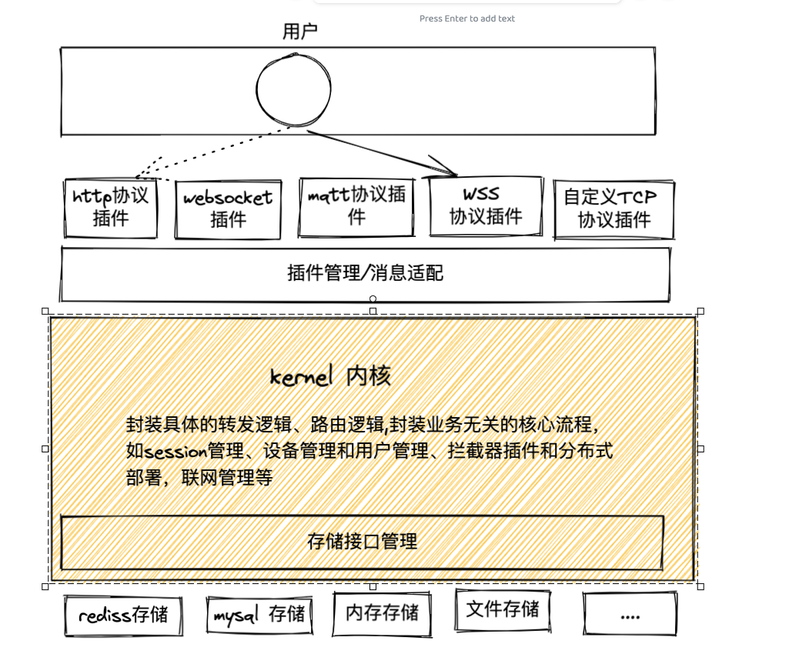
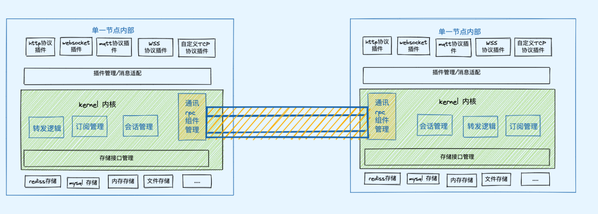

# 概述
一个可自由插拔的消息中间件，通过插件机制添加各种不通的协议，目前主要支持如下功能：
- [x] MQTT v3.1 和 v3.1.1功能 的 qos0 和 qos1 消息，qos2 消息目前只实现部分
- [x] 支持UDP协议
- [x] 支持MQTT webSocket 协议
- [x] 支持TCP的SSL 协议
- [x] 支持自定义协议插件，目前MQTT协议就是插件实现的
- [x] 支持自定义存储组件
- [x] 支持H2DB存储
- [x] memory存储
- [x] 支持 SSH 协议，通过ssh 可以登录到服务器内部。
- [ ] levelDB存储实验中
- [ ] 文件系统存储 文件系统目前处于实验阶段

# 服务架构实现
##### 单机架构架构
&emsp;&emsp; 考虑到系统的扩展性，业务系统采用可插拔式设计，消息和转发逻辑封装在cote包中，具体的业务逻辑通过插件方式实现。具体如下图所示：

*概念：*

插件管理接口

单机内部架构

##### 单机和集群之间的通讯组网
&emsp;&emsp; 节点之间的通讯统一由内核封装，这里使用一个接口管理，可以由用户自由实现多种协议插件方式自由扩展服务见通讯方式。

内部通讯模块架构

# 模块分析
- broker-agent：全链路追踪日志收起agent，目前还没实现，只是跑通流程
- broker: 代理转发服务，目前实现了部分mqtt协议消息的代理转发
- broker-console：ssh 与 broker服务交互的sshd服务
- broker-kernel: 内核服务，对应上面的 kernel 内核模块
- broker-route :服务之间路由模块
- broker-rpc: 自定义udp实现的rpc模块，目前实验阶段，还没有正式使用
- broker-store: 存储模块，提供了多种存储插件方式，如H2，levelDB等各种存储方式
- mqtt-de-encoder：mqtt协议的编码解码器，增强netty 内置的编码解码器模块。

# 工作列表
- [x] 核心代码放置在核心模块中，启动协议放置在核心模块中
- [x] 添加ssh server到服务中，可以直接通过ssh 连接到服务内部查看内存占用，线程等服务器运行信息
- [ ] 把启动代码放置到核心模块中
- [ ] 服务器之间的rpc 模块放置在核心模块中
- [ ] 监控服务放置在核心模块中

